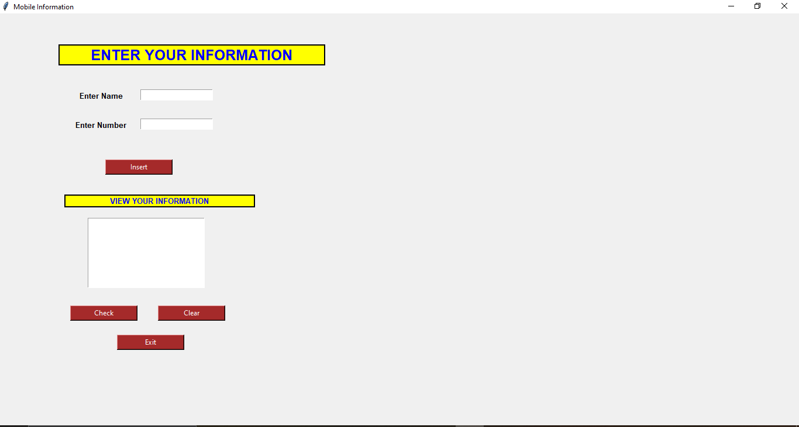

# Mobile-Information

This application is a simple graphical user interface `(GUI)` built using Python's `Tkinter` library. The application allows users to input their names and mobile numbers, store them in a text file, and view the stored information.

# Features
1. Insert Information: Add new name and number entries to a text file.
2. Check Information: Display all the stored entries in reverse order.
3. Clear Fields: Clear the input fields for new entries.
4. Exit Application: Close the application window.

# Usage
1. Insert Information:
- Enter your name and number in the respective fields and click "Insert".

2. Check Information:
- Click "Check" to view all stored information in reverse order.

3. Clear Fields:
- Click "Clear" to clear the input fields.

4. Exit Application:
- Click "Exit" to close the application.

# How to Run the Project
To run this project, follow these steps:

1. Ensure Python is Installed:
- Download and install Python from the official website.

2. Install Tkinter:
- Tkinter is included with Python installations, but if it is not installed, you can install it using the following command:

`pip install tk`

3. Clone or Download the Project:
- Clone the repository or download the project files to your local machine.

4. Navigate to the Project Directory:
- Open a terminal or command prompt.
- Navigate to the directory where your project files are located:

5. Ensure the `numbers.txt` File Exists:
- Create an empty `numbers.txt` file in the project directory if it does not already exist.

6. Run the Python Script:
- Execute the script by running the following command in the terminal:

`python mobile_information.py`

7. Interact with the Application:
- The application window should open, and you can start interacting with it by entering your information, checking stored information, clearing fields, and exiting the application.

# Images

